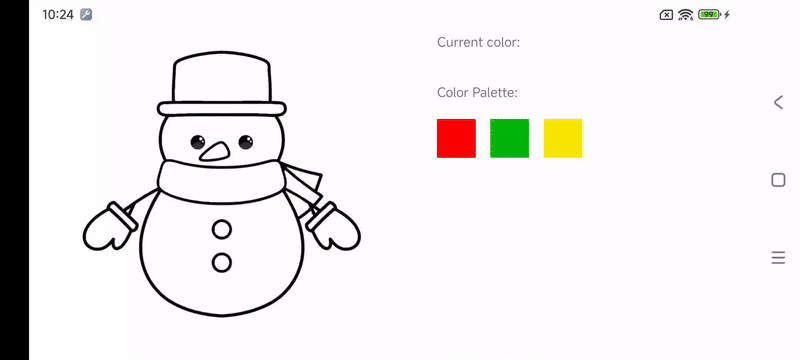

Data requirements:

Cung cấp 1 file ảnh có các yêu cầu
  - Kích thước tối đa 1024 x 1024.
  - Thuần 2 màu đen trắng (càng ít răng cưa càng tốt).
  - Không nên có các chi tiết quá nhỏ.

Ưu điểm:
- Content dễ chuẩn bị.
- Animation mượt.

Nhược điểm:
- Khi zoom lên ảnh sẽ bị vỡ.
- Tô màu sẽ bị răng cưa.
- Các chi tiết nhỏ tô không được chính xác.
- Khó khăn trong việc xác định đã tô được bao nhiêu % ảnh.

Demo:
